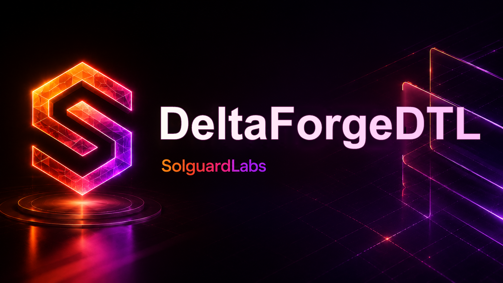

# DeltaForgeDTL



DeltaForgeDTL es un motor local de reconciliacion escrito en Go. Modela ciclos
de diferencias entre estados esperados y estados ejecutados, genera snapshots
deterministas, planifica correcciones directas y produce una liquidacion final
con contrato JSON estable para herramientas externas.

El binario no depende de servicios externos. Los tests TypeScript ejecutan la
CLI contra fixtures deterministas y validan el flujo publico del motor.

## Componentes

- `src/types.go`: tipos de dominio, politicas, diferencias y reportes.
- `src/amount.go`: aritmetica entera, pesos y reparto proporcional.
- `src/ledger.go`: ledger de cuentas, assets, balances y eventos.
- `src/policy.go`: normalizacion y validacion de fixtures/politicas.
- `src/snapshot.go`: snapshots canonicos y hash SHA-256 estable.
- `src/reconcile.go`: clasificacion de diferencias y pools globales.
- `src/corrections.go`: planificacion y aplicacion de correcciones directas.
- `src/settlement.go`: liquidacion final, allocations y floors.
- `src/report.go`: ejecucion del engine y serializacion JSON.
- `src/scenarios.go`: escenarios integrados de humo y demo.
- `src/audit.go`: invariantes, exposiciones y perfiles de revision.
- `src/main.go`: CLI del motor.

## Requisitos

- Go 1.22 o superior.
- Node.js 24 o superior.

## Uso

Compilar:

```bash
npm run build
```

Listar escenarios integrados:

```bash
out/deltaforgedtl --list
```

Ejecutar un escenario:

```bash
out/deltaforgedtl scenario baseline
```

Ejecutar un fixture:

```bash
out/deltaforgedtl run tests/fixtures/reconciliation_cycle.json
```

Validar un fixture:

```bash
out/deltaforgedtl validate tests/fixtures/reconciliation_cycle.json
```

## Tests

```bash
npm test
```

La suite compila el binario y ejecuta:

```bash
node --test "tests/node/*.test.ts"
```

Los tests publicos cubren:

- contrato CLI y validacion de fixtures;
- snapshots y totales finales;
- reconciliacion de diferencias operativas;
- correcciones directas;
- liquidacion final.

## CI

El workflow de GitHub Actions instala Go y Node.js, y ejecuta:

```bash
bash scripts/ci.sh
```

## Estado Del Lab

DeltaForgeDTL esta disenado como un repositorio autocontenido de revision
tecnica. El contrato principal es la salida JSON de la CLI.
