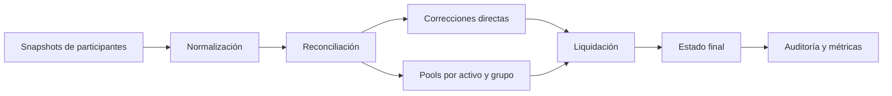
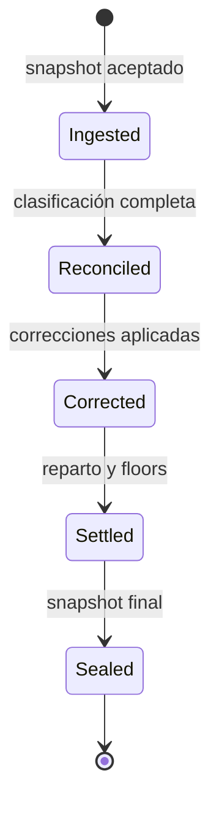

# DeltaForgeDTL


DeltaForgeDTL es un motor determinista de conciliación y liquidación para redes institucionales. Compara posiciones esperadas y ejecutadas, clasifica diferencias por política, produce correcciones directas, gestiona pools por activo y grupo y genera un snapshot firmado por hash. El núcleo Go opera exclusivamente con enteros; el SDK TypeScript mantiene precisión con `bigint` y envía escrituras idempotentes por HTTPS.

La versión `1.0.0` fija el contrato JSON, el modelo de capital y la promoción inmutable entre `main`, `production`, el tag anotado y la publicación.

## Vista general





## Propiedades operativas

- Identificadores únicos y entradas normalizadas antes de crear el ledger.
- Importes enteros en la unidad mínima de cada activo.
- Orden estable de activos, cuentas, diferencias y movimientos finales.
- Snapshot canónico SHA-256 para comparar ejecuciones.
- Haircut de reserva a la baja; shock de demanda y buffer al alza.
- Métricas de cobertura, liquidez, capacidad, shortfall y concentración HHI.
- Gobierno con quorum, timelock, caducidad, predecesores y guardián separado.
- Cliente HTTPS con timeout, rechazo de redirecciones e idempotencia.

El requisito de capital por ruta se calcula como:

```text
drift_observado = abs(gross_expected − gross_executed)
demanda_bruta = drift_observado + abs(global_pool) + open_corrections
demanda_estresada = ceil(demanda_bruta × (10 000 + shock_bps) / 10 000)
reserva_efectiva = floor(reserva × (10 000 − haircut_bps) / 10 000)
buffer = ceil(gross_expected × buffer_bps / 10 000)
reserva_requerida = demanda_estresada + buffer
```

Una ruta solo es conforme si `min(reserva_efectiva, reserva_líquida)` cubre la reserva requerida.

## Componentes

| Superficie | Responsabilidad |
| --- | --- |
| `src/ledger.go` | Cuentas, activos, balances y journal |
| `src/reconcile.go` | Clasificación y pools de ajuste |
| `src/corrections.go` | Plan y aplicación de correcciones materiales |
| `src/settlement.go` | Reparto final y floors |
| `src/capital.go` | Estrés por ruta y agregación de cartera |
| `src/governance.go` | Operaciones administrativas canónicas |
| `src/snapshot.go` | Representación y hash deterministas |
| `src/audit.go` | Invariantes, exposición y buckets |
| `sdk/deltaForgeClient.ts` | Cálculo paritario y transporte institucional |

## Inicio rápido

Requisitos: Go `1.26.4` y Node.js `24`.

```bash
npm ci
npm run ci
```

Operar la CLI:

```bash
npm run build
out/deltaforgedtl --list
out/deltaforgedtl scenario baseline
out/deltaforgedtl run tests/fixtures/reconciliation_cycle.json
out/deltaforgedtl validate tests/fixtures/reconciliation_cycle.json
```

Evaluar capital desde TypeScript:

```ts
import { evaluateCapital } from "./sdk/deltaForgeClient.ts";

const metrics = evaluateCapital({
  asset: "usd",
  group: "primary",
  reserve: 1_000_000n,
  liquidReserve: 800_000n,
  grossExpected: 900_000n,
  grossExecuted: 870_000n,
  openCorrections: 20_000n,
  globalPool: 10_000n,
  correctionCapacity: 500_000n,
  reserveHaircutBps: 500n,
  driftShockBps: 2_000n,
  operationalBufferBps: 800n,
});
```

## Documentación

- [Arquitectura](./docs/arquitectura.md)
- [Modelo económico](./docs/modelo-economico.md)
- [Ciclo de conciliación](./docs/ciclo-conciliacion.md)
- [Integración](./docs/integracion.md)
- [Operaciones](./docs/operaciones.md)
- [Observabilidad](./docs/observabilidad.md)
- [Gobernanza](./docs/gobernanza.md)
- [Política de seguridad](./SECURITY.md)

## Calidad y promoción

`npm run ci` valida Prettier, `gofmt`, build, `go vet`, pruebas Go y Node, profundidad del código, identidad del banner, documentación y dependencias. GitHub ejecuta la misma secuencia en Linux y Windows. Una entrega válida mantiene el mismo commit en `main`, `production`, el tag `v1.0.0` y `Production 1.0.0`.

## Licencia

[MIT](./LICENSE).
