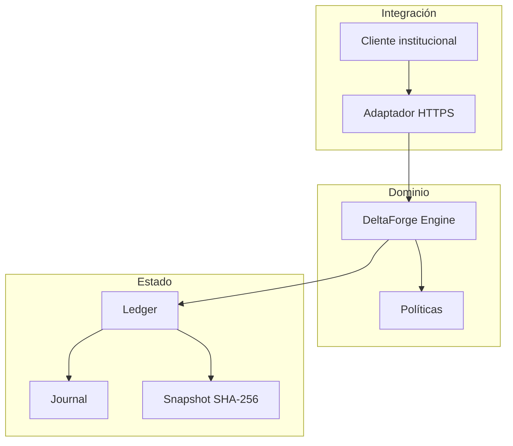
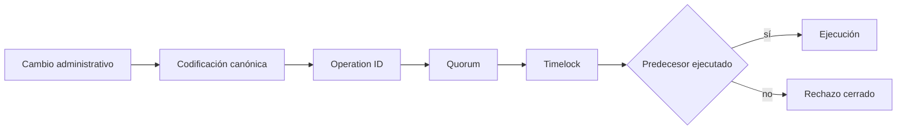
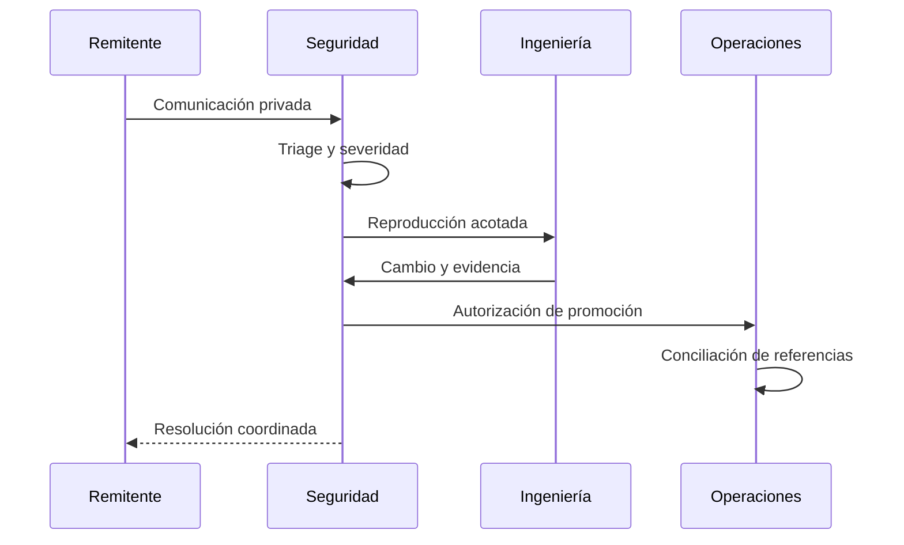

# Política de seguridad

## Versiones mantenidas

| Versión | Estado | Canal |
| --- | --- | --- |
| `1.0.x` | Mantenida | `production` |
| `< 1.0.0` | Fuera de soporte | — |

## Comunicación responsable

Utiliza **Security → Report a security issue** en GitHub para comunicar de forma privada comportamientos que afecten a autorización, integridad contable, disponibilidad o confidencialidad. No publiques datos operativos en una issue.

Incluye commit, fixture mínimo, precondiciones, componente, impacto, salida JSON relevante y propiedad esperada. No adjuntes credenciales, claves, datos personales ni información de terceros. El equipo confirmará la recepción y coordinará análisis, corrección y divulgación.

## Fronteras de confianza

## Controles obligatorios

- Unicidad y normalización de cuenta, activo, grupo y operación.
- Aritmética entera con comprobación de overflow en cálculos de capital.
- Snapshot canónico y orden estable para evidencia reproducible.
- Separación entre adaptación HTTP y autoridad del motor.
- Claves de idempotencia distintas por escritura.
- Quorum, timelock, caducidad y predecesores para cambios de política.
- Conciliación de expected, executed, final, correcciones, pools y remanentes.
- Dependencias bloqueadas y revisión CODEOWNERS.

## Matriz de aseguramiento

| Área | Propiedad | Evidencia |
| --- | --- | --- |
| Ingesta | IDs únicos y política válida | validación de fixtures |
| Capital | Reserva disponible cubre demanda estresada | pruebas de `capital` |
| Gobierno | Cambio maduro y aprobado | pruebas de `governance` |
| Cliente | Precisión e idempotencia | pruebas del SDK |
| Promoción | Referencias en un commit | workflow de integridad |

## Respuesta

