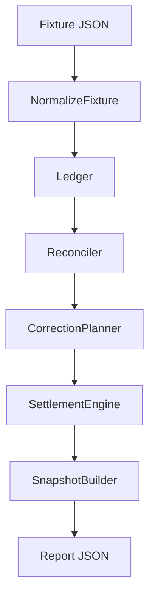
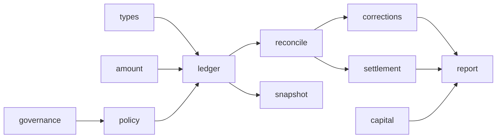
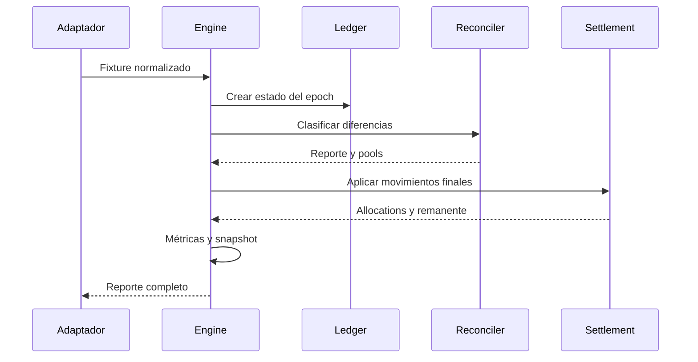

# Arquitectura de DeltaForgeDTL

## Diseño

DeltaForgeDTL separa ingesta, dominio, contabilidad y proyecciones. `Engine.Run` recibe un `Fixture`, normaliza la política, construye el ledger, valida precondiciones y ejecuta las fases en orden. Ningún módulo usa red ni reloj del host; `epoch` se proporciona con la entrada.

El contrato de salida reúne activos, cuentas, snapshot, reconciliación, correcciones, settlement y métricas. El journal es opcional en la respuesta, pero las transiciones del motor mantienen una secuencia determinista.

## Dependencias internas

Los tipos `Amount` representan `int64` en la unidad mínima del activo. Los cálculos de capital que multiplican ratios usan enteros de precisión ampliada y vuelven a `Amount` solo después de comprobar el rango.

## Transacción lógica

La persistencia externa debe publicar el reporte únicamente si todo el ciclo termina. Para concurrencia distribuida, se recomienda compare-and-swap sobre `book + epoch` y una clave de idempotencia ligada al hash canónico de la entrada.

## Partición

`asset + adjustmentGroup` es la ruta natural para métricas y capacidad. El ledger sigue siendo la unidad de consistencia del ciclo porque una cuenta puede mantener varios activos. Las lecturas para cierre deben provenir de un único snapshot sellado.
