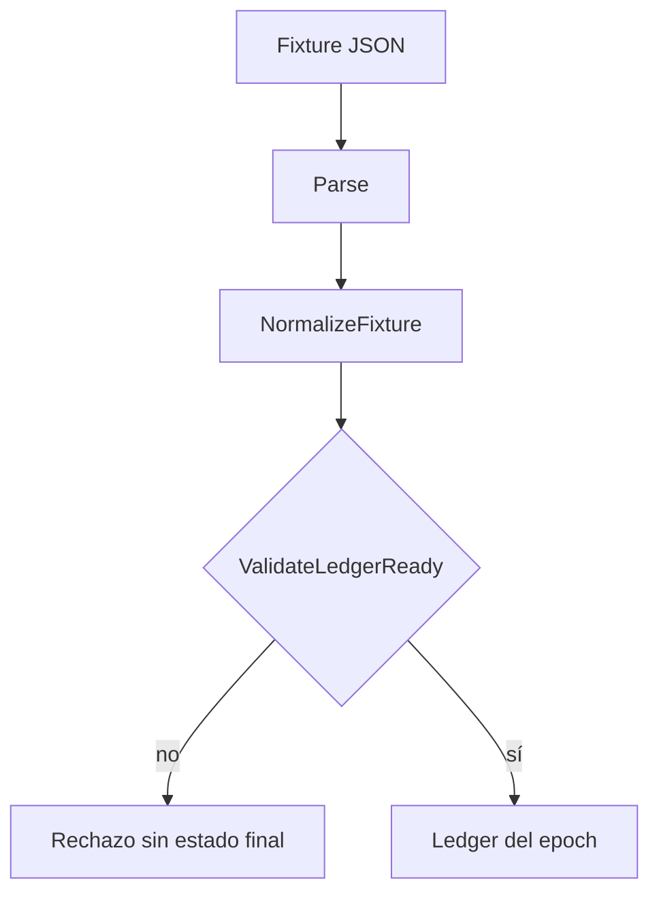
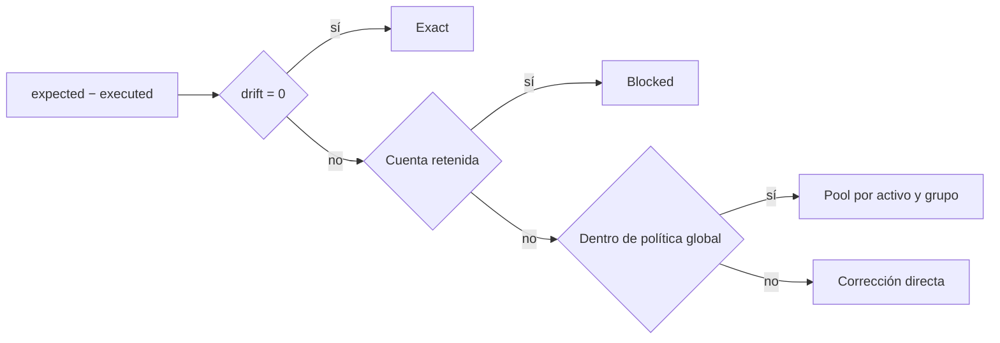
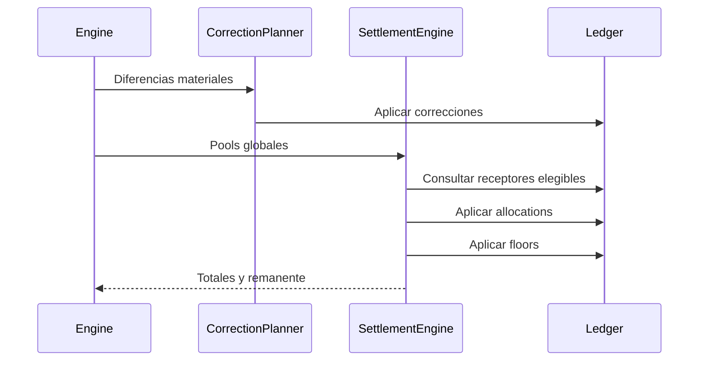
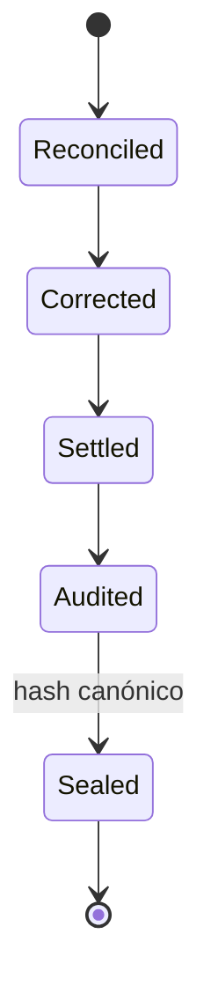

# Ciclo de conciliación

## Ingesta

Un ciclo declara nombre, epoch, book, activos, cuentas, política y etiquetas. La normalización aplica defaults explícitos; la validación exige IDs únicos, al menos una cuenta y dominios numéricos admisibles.

`Final` parte de `Executed` cuando no se aporta expresamente. Esto permite distinguir el estado ejecutado de los movimientos que aplica el ciclo.

## Clasificación

Cada `Difference` conserva cuenta, propietario, activo, drift absoluto, grupo y peso observado. Los pools se ordenan por activo y grupo. Las correcciones directas se planifican y aplican antes del settlement global.

## Settlement

El reparto usa pesos enteros y largest remainder para distribuir unidades residuales de forma estable. Un movimiento que no puede aplicarse vuelve al remanente y el ciclo queda incompleto.

## Sellado

El reporte recalcula balances por activo después del settlement, construye métricas y produce el snapshot final. Un consumidor debe conservar `book`, `epoch`, hash, commit de configuración y clave de idempotencia.

## Cierre

1. El número de cuentas y activos coincide con la entrada aceptada.
2. Las correcciones tienen traza e ID estable.
3. Los pools se explican por diferencias clasificadas.
4. Allocations más remanente explican el neto de pools.
5. Expected, executed y final cuadran por activo.
6. El modelo de capital no presenta shortfall.
7. El hash del snapshot coincide en reejecución determinista.
