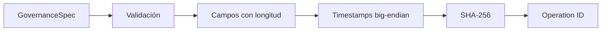
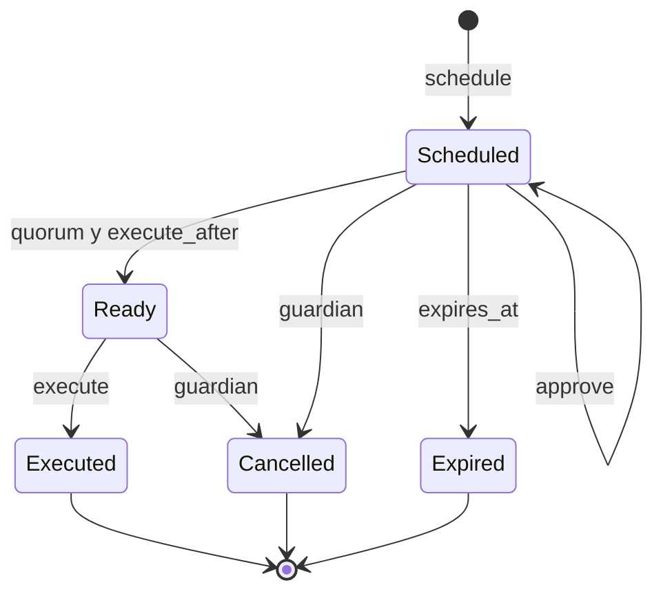
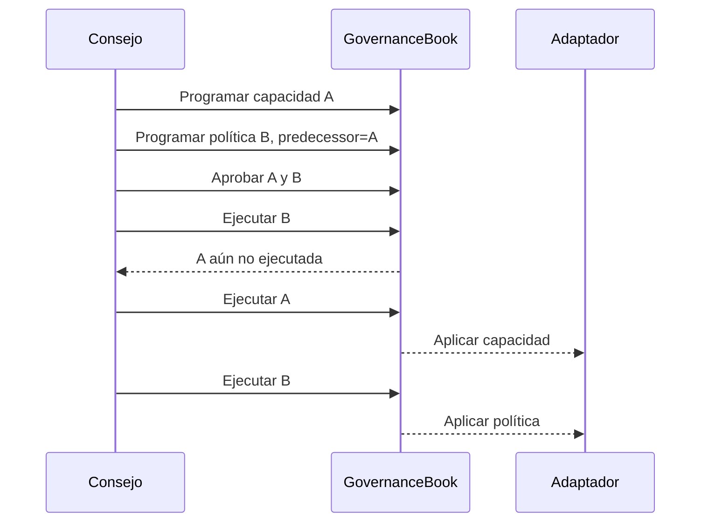

# Gobernanza

## Operación canónica

Cada cambio declara dominio, red, destino, método, hash del payload, salt, inicio, caducidad y predecesor opcional. La codificación antepone la longitud de cada texto en big-endian; el ID es SHA-256 de esos bytes.

Dominio y red evitan reutilizar aprobaciones entre entornos. El salt separa cambios con payload idéntico. Toda variación genera otro ID y requiere nuevas aprobaciones.

## Estados

Las aprobaciones forman un conjunto ordenado; repetir un gobernador no aumenta quorum. El guardián debe ser independiente del consejo y solo puede cancelar operaciones no terminales con una nota normalizada.

## Dependencias

El adaptador confirma que el registro está en `executed` y que su ID corresponde exactamente al payload aplicado.

## Política recomendada

| Cambio | Quorum | Timelock | Caducidad |
| --- | ---: | ---: | ---: |
| Umbrales de alerta | 2/3 | 6 h | 48 h |
| Capacidad y tolerancias | 3/5 | 24 h | 72 h |
| Activos y grupos | 4/7 | 48 h | 96 h |
| Cancelación de emergencia | guardián | inmediata | puntual |

Cada ejecución conserva spec, ID, aprobadores, timestamps, estado terminal, commit y reporte posterior.
