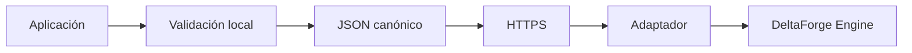
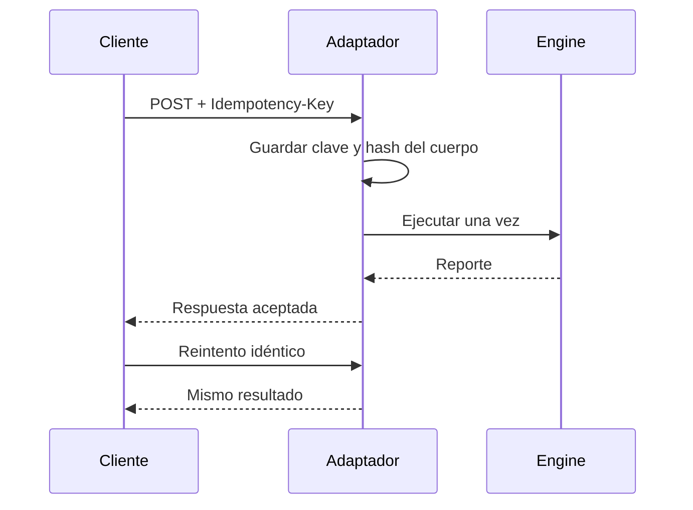
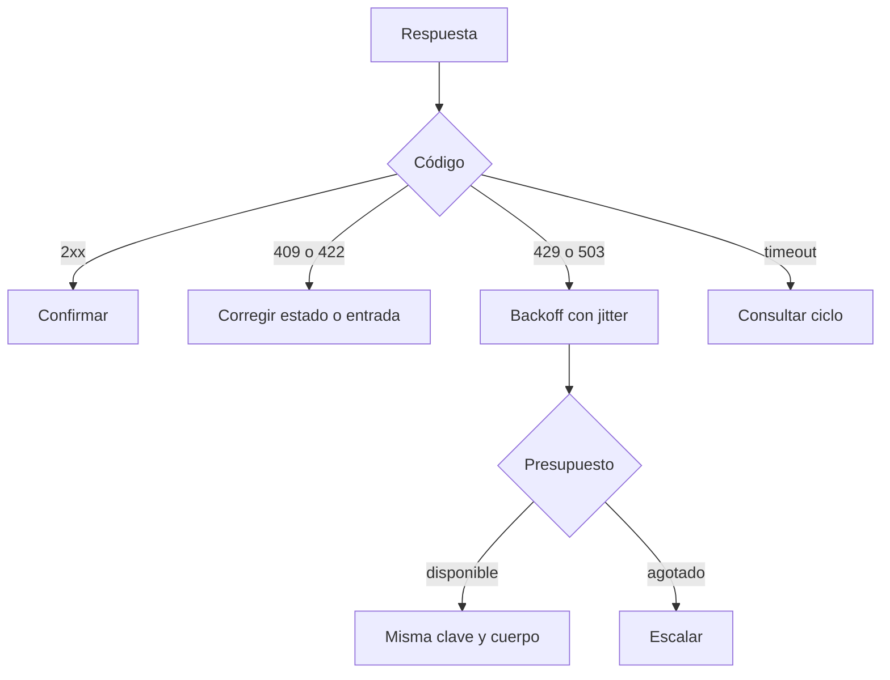

# Integración

## SDK

`sdk/deltaForgeClient.ts` expone el modelo de capital y un cliente HTTP. Los importes son `bigint`; el JSON canónico los emite como literales enteros y ordena claves. El cliente exige HTTPS, limita timeout y rechaza redirecciones.



```ts
import { DeltaForgeClient } from "./sdk/deltaForgeClient.ts";

const client = new DeltaForgeClient({
  baseUrl: "https://api.deltaforge.example/settlement/",
  timeoutMs: 8_000,
});

const accepted = await client.submitSnapshot(
  { book: "df-main", epoch: 7001, expectedTotal: 900_000n },
  { idempotencyKey: "snapshot-20260815-0001" },
);
```

## Endpoints de referencia

| Método | Ruta | Función |
| --- | --- | --- |
| `GET` | `/v1/cycles/{id}` | Consultar estado y reporte |
| `POST` | `/v1/snapshots` | Registrar snapshot de entrada |
| `POST` | `/v1/cycles/{id}/reconciliation` | Ejecutar un ciclo aceptado |

Los errores usan `code` y `message`. El código es estable para automatización. Se recomienda `409` para conflicto de estado, `422` para semántica inválida y `503` si no puede confirmarse una escritura.

## Idempotencia



Una clave con cuerpo distinto responde conflicto. El timeout no demuestra fallo: el cliente consulta por ciclo y reutiliza la misma clave antes de cualquier reintento.

## Reintentos



## Compatibilidad

La serie `1.0.x` mantiene semántica de estados, direcciones de redondeo y campos existentes. Añadir propiedades de respuesta es compatible si el consumidor ignora campos desconocidos. Cambiar una unidad, fórmula o estado requiere versión mayor.
