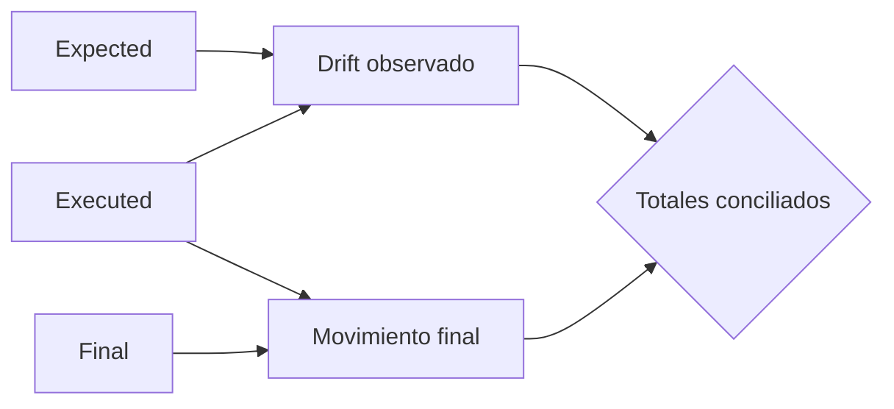
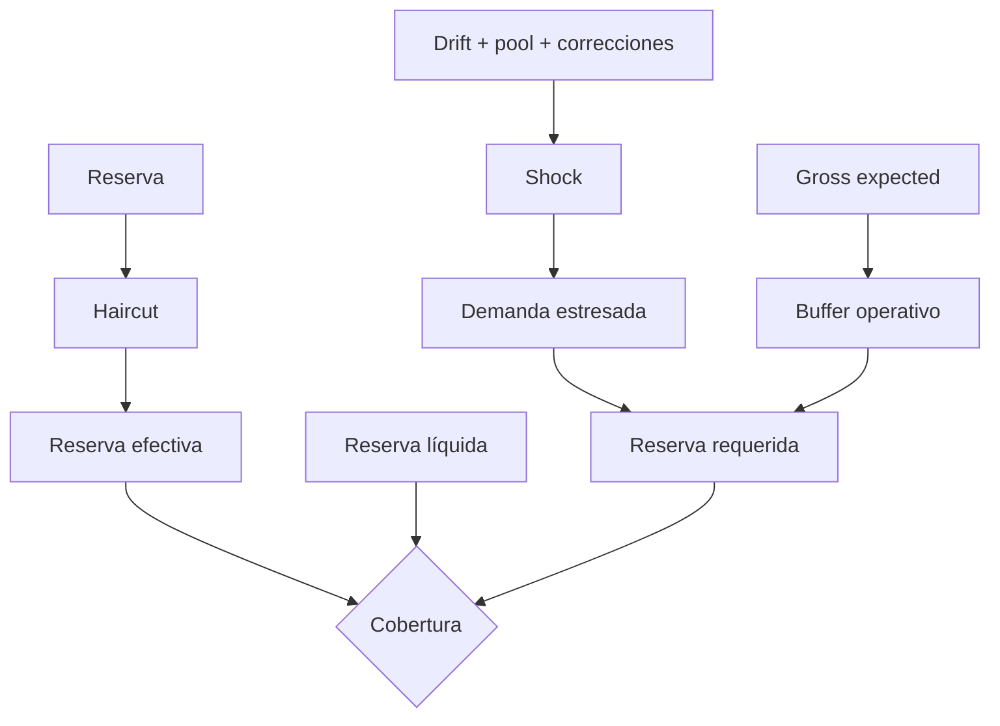
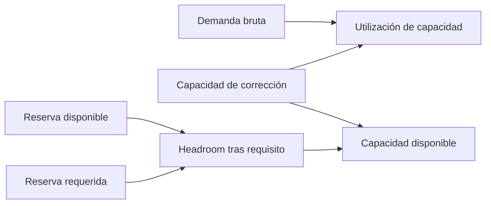
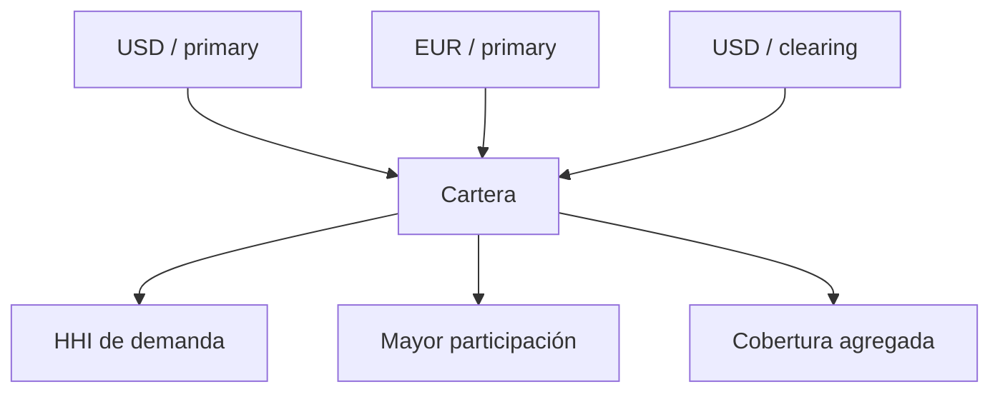

# Modelo económico

## Tres planos contables

DeltaForgeDTL conserva expected, executed y final. `expected - executed` es el drift observado; `final - executed` es el movimiento efectivamente materializado. El cierre por activo compara ambos totales.

Las diferencias exactas no generan movimiento. Las diferencias materiales siguen una corrección directa. Las diferencias incluidas en política global forman pools por activo y grupo, que la fase de settlement distribuye con pesos normalizados.

## Capital bajo estrés

Ejemplo:

| Entrada | Valor |
| --- | ---: |
| Reserva | 1.000.000 |
| Reserva líquida | 800.000 |
| Gross expected | 900.000 |
| Gross executed | 870.000 |
| Correcciones abiertas | 20.000 |
| Pool | 10.000 |
| Haircut | 500 bps |
| Shock | 2.000 bps |
| Buffer | 800 bps |

La demanda bruta es `60.000`, la estresada `72.000`, el buffer `72.000` y el requisito `144.000`. La reserva efectiva es `950.000`; la ruta está cubierta por reserva efectiva y liquidez.

## Capacidad

`availableCapacity` es el mínimo entre capacidad configurada y headroom de reserva. No es una autorización de ejecución: sirve para admisión operativa y debe recalcularse con el snapshot vigente.

## Concentración

La participación de una ruta es `demanda_r / demanda_total`; el HHI en bps suma `share_bps² / 10.000`. La agregación no compensa un shortfall individual: `compliant` exige que todas las rutas sean conformes.

## Supuestos

- Reserva y posiciones pertenecen al mismo snapshot.
- La reserva líquida no supera la reserva contable.
- Los activos no se compensan entre sí sin una regla externa de valoración.
- Los parámetros de estrés están versionados mediante gobierno.
- Los importes se expresan siempre en unidades mínimas enteras.
