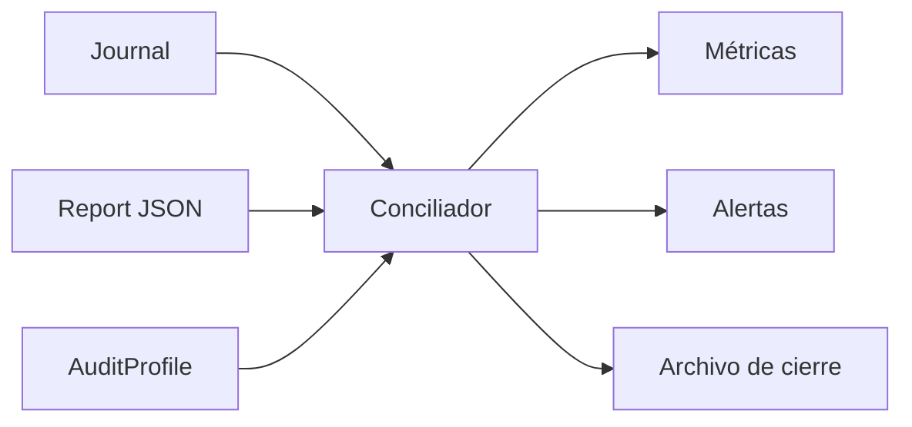
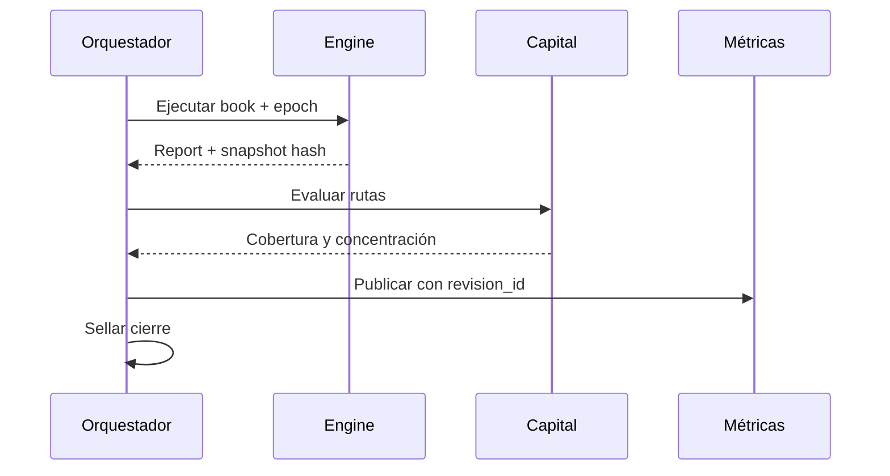
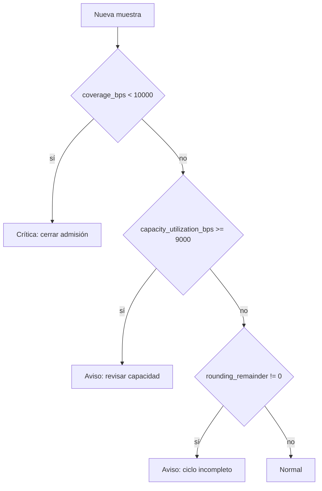

# Observabilidad

## Fuentes

Las señales se derivan del `Report`, `AuditProfile` y snapshot. El texto de consola no es fuente contable. Cada muestra debe incluir `book`, `epoch`, hash de snapshot y commit de configuración.

## Métricas

| Métrica | Tipo | Etiquetas |
| --- | --- | --- |
| `deltaforge_observed_drift` | gauge | `asset`, `group` |
| `deltaforge_open_corrections` | gauge | `asset`, `group` |
| `deltaforge_capital_coverage_bps` | gauge | `asset`, `group` |
| `deltaforge_capacity_utilization_bps` | gauge | `asset`, `group` |
| `deltaforge_receiver_hhi_bps` | gauge | `asset`, `group` |
| `deltaforge_rounding_remainder` | gauge | `book` |
| `deltaforge_cycle_total` | counter | `result` |

IDs de cuenta, operación o idempotencia no se usan como etiquetas. Pueden aparecer en trazas de acceso restringido.

## Cierre observable

Un intento incompleto no reemplaza el último cierre confirmado. La reejecución del mismo input debe producir el mismo hash y el mismo orden de movimientos.

## Alertas

Una alerta no modifica parámetros automáticamente. Prepara evidencia para una operación de gobierno y conserva el snapshot que la originó.

## Trazabilidad

Las trazas enlazan `request_id`, `cycle_id`, `operation_id`, `snapshot_hash` y `revision_id`. Se excluyen secretos y payloads de autenticación. El journal puede reconstruir la proyección de observabilidad.
