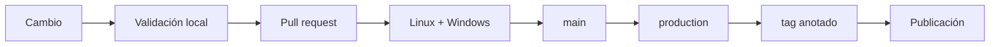
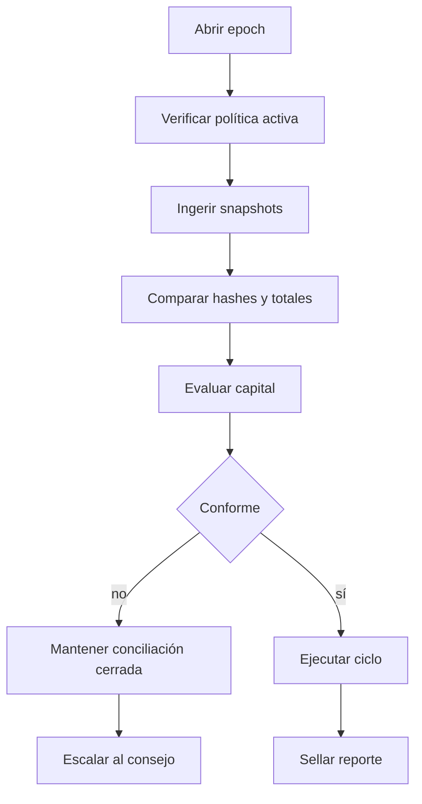
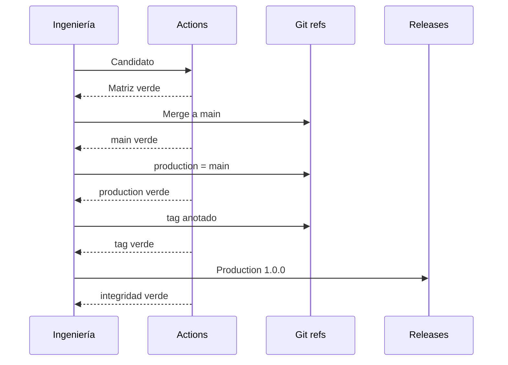

# Operaciones

## Validación

La secuencia local y CI es idéntica:

```bash
npm ci
npm run ci
```

Incluye Prettier, `gofmt`, build reproducible, `go vet`, pruebas Go y Node, verificación documental, hash del banner y auditoría de dependencias.



## Rutina de epoch



El cierre conserva input canónico, reporte, journal, parámetros, métricas, commit y responsable. El epoch del dominio prevalece sobre la hora del host.

## Promoción



No se reconstruye código entre referencias. `main`, `production`, el commit pelado del tag y la publicación deben coincidir.

## Recuperación

Ante una inconsistencia se cierra la admisión en el adaptador, se preservan input y estado, se captura el reporte y se reconstruye el journal. No se editan balances manualmente. La reanudación requiere causa explicada, conciliación completa y, cuando cambie política, una operación de gobierno ejecutada.

Una versión anterior solo puede leer estado si conserva esquema y semántica. El rollback de binario no revierte el ledger; cualquier compensación se registra como una nueva transición.

## Checklist de entrega

1. Árbol limpio y lockfile actualizado.
2. Dos jobs candidatos verdes.
3. PR revisado y fusionado.
4. `main` y `production` verdes en el mismo SHA.
5. Tag anotado sobre ese SHA.
6. Publicación no draft ni prerelease.
7. Integridad confirmada tras el evento release.
